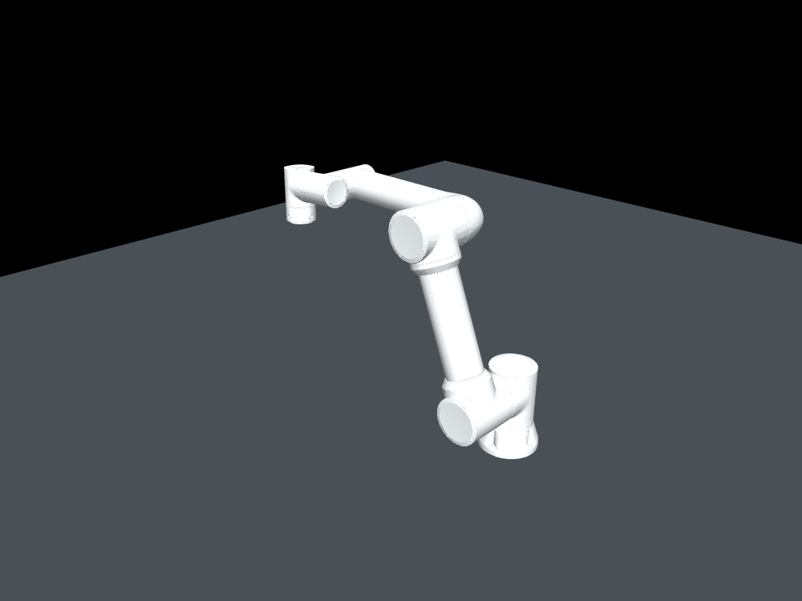
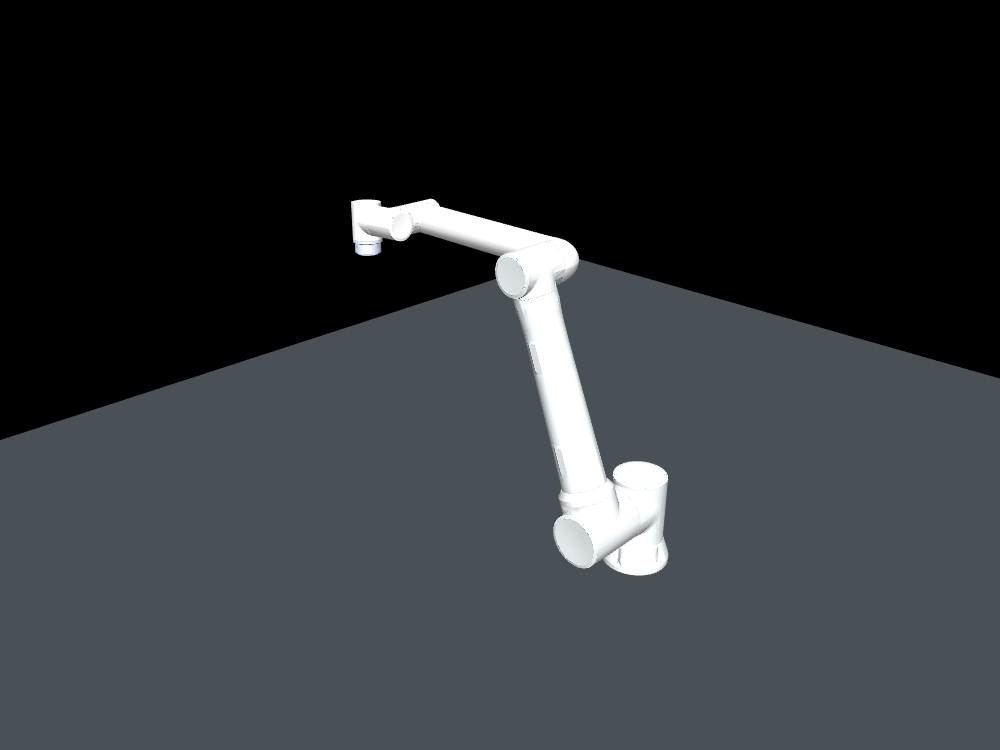
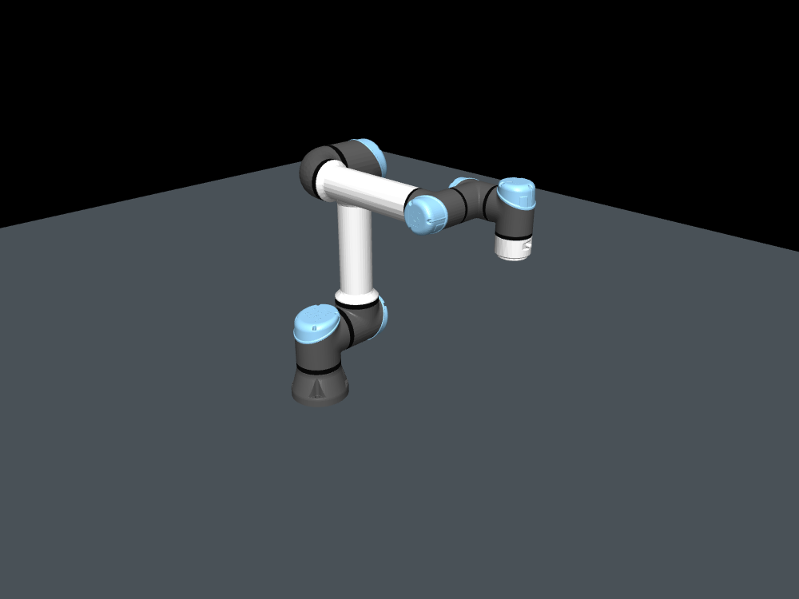

# mujoco-ros2-manipulation

MuJoCo와 ROS 2 Humble, ros2_control, MoveIt 2를 연결한 로봇팔 시뮬레이션 프로젝트입니다.
FAIRINO FR5·FR10과 Universal Robots UR5e를 공통 실행기로 선택하며,
제조사 모델 변환부터 경로 계획·실행, 관절 상태 기반 완료 확인과 정상 종료까지 검증했습니다.

## 지원 모델과 실행 화면

| FAIRINO FR5 V6 | FAIRINO FR10 V6 | Universal Robots UR5e |
|---|---|---|
| [](docs/robots/fr5/README.md) | [](docs/robots/fr10/README.md) | [](docs/robots/ur5e/README.md) |
| [FR5 실행·설정·스크린샷](docs/robots/fr5/README.md) | [FR10 실행·설정·스크린샷](docs/robots/fr10/README.md) | [UR5e 실행·설정·스크린샷](docs/robots/ur5e/README.md) |

미리보기는 초기 자세의 MuJoCo Python 렌더입니다. 모델별로 카메라를 맞췄으며,
실물 크기 비교 기준은 아닙니다. 각 모델 문서에는 **실제 MuJoCo·RViz GUI 스크린샷**과
2026-10-07 촬영 실행의 검증 기록·이미지 해시를 함께 보관합니다.

| 모델 ID | 계획 그룹 | 궤적 제어기 | 계획 끝단 프레임 |
|---|---|---|---|
| `fr5` | `fairino5_v6_group` | `fairino5_controller` | `wrist3_link` |
| `fr10` | `fairino10_v6_group` | `fairino10_controller` | `wrist3_link` |
| `ur5e` | `ur5e_manipulator` | `ur5e_controller` | `tool0` |

FR5·FR10은 제조사 URDF/STL을, UR5e는 공식 Xacro와 DAE에서 변환한 시각 메시를 사용합니다.
UR5e의 `wrist_3_link → flange → tool0` 고정 좌표계를 보존했습니다.
FR5·FR10은 현재 `wrist3_link`를 끝단으로 사용하며 별도 도구 TCP는 아직 없습니다.
모델 차이와 출처는 [모델 자료 목록](docs/robots/README.md)에서 확인할 수 있습니다.

## 제어 구조

```text
MoveIt 2 / ROS 2 JointTrajectory 명령
  → JointTrajectoryController (ros2_control)
  → mujoco_ros2_control
  → MuJoCo 관절 위치 서보

관절 상태·좌표계·시뮬레이션 시간 → /joint_states · /tf · /tf_static · /clock
```

모델별 YAML 프로필에서 관절 이름·순서, 초기 자세, 서보 게인, ROS 이름과 검증 목표를 관리합니다.
같은 프로필로 MuJoCo 모델과 ROS 제어기 설정을 생성하고, 관절 이름으로 연결합니다.
위치 서보는 목표 각도에 따른 힘을 계산하므로 중력·관성·토크 제한의 영향을 받습니다.

## 빠른 실행

명령은 저장소 루트에서 실행합니다. **처음 설치하는 PC는 [설치와 빌드 안내](docs/setup.md)를 먼저 따릅니다.**
빌드와 모델 생성이 완료된 환경에서는 다음으로 FR5를 실행합니다.

```bash
.venv/bin/python prepare_robot.py --list
bash run_sim.sh robot:=fr5
```

MuJoCo와 RViz가 함께 열립니다. RViz의 MotionPlanning에서 모델의 계획 그룹을 선택하고,
현재 상태에서 목표 마커를 이동한 뒤 `Plan`으로 경로를 확인하고 `Execute`로 실행합니다.
관절 각도 단위는 rad입니다.

### 모델 변경과 실행 옵션

현재 launch를 **Ctrl+C로 종료한 뒤**, 원하는 모델의 명령 하나를 실행합니다.
기본 실행 도메인은 세 모델 모두 89입니다.

| 실행 대상 | 명령 |
|---|---|
| FR5 | `bash run_sim.sh robot:=fr5` |
| FR10 | `bash run_sim.sh robot:=fr10` |
| UR5e | `bash run_sim.sh robot:=ur5e` |
| GUI 없이 FR5 + MoveIt | `bash run_sim.sh robot:=fr5 gui:=false rviz:=false` |
| MuJoCo + ros2_control만 실행 | `bash run_sim.sh robot:=fr5 moveit:=false rviz:=false` |

추가 터미널에서 상태를 확인할 때는 같은 환경을 적용합니다.

```bash
source ./manipulation_env.sh
ros2 control list_controllers
ros2 topic echo /joint_states sensor_msgs/msg/JointState --once
```

### 모델 설정 수정

[FR5](config/robots/fr5.yaml), [FR10](config/robots/fr10.yaml),
[UR5e](config/robots/ur5e.yaml) 프로필을 수정한 뒤 해당 모델을 재생성합니다.
공통 제어 주기와 궤적 허용 오차는 [controller_defaults.yaml](config/controller_defaults.yaml)에 있습니다.

```bash
.venv/bin/python prepare_robot.py --robot ur5e
```

실행 중인 모델을 종료한 뒤 다시 실행해야 변경이 반영됩니다.
실행기와 검증기는 프로필 해시가 다른 오래된 생성 모델의 사용을 차단합니다.
`use_sim_time`은 시간 기준을 정하는 옵션이며, 모델이나 실제 로봇을 선택하는 옵션은 아닙니다.

## 검증 환경과 결과

| 항목 | 확인한 환경 |
|---|---|
| OS / Python | Ubuntu 22.04.5 / Python 3.10 |
| ROS / MoveIt | ROS 2 Humble / MoveIt 2.5.10 |
| ROS 시뮬레이션 런타임 | MuJoCo 3.12.0 / mujoco_ros2_control 0.1.2 + 로컬 종료 패치 |
| 모델 변환·기준 렌더 | `.venv`의 MuJoCo 3.14.0 / NumPy 1.26.4 |
| 그래픽 | GTX 1050 Ti 4 GB / NVIDIA 580.178.04 / 데스크톱 OpenGL 4.6 |
| 갱신 주기 | 물리 0.002초 / ros2_control 100 Hz / 관절 상태 설정 50 Hz |

위 표는 실제 검증한 환경입니다. 일반 MuJoCo 물리 계산은 CPU에서 수행하며 GPU는 렌더링에 사용합니다.
ROS 런타임과 Python MuJoCo는 별도로 구성했습니다.

| 모델 | 궤적·MoveIt·TF·시계 | 궤적 종료 후 최대 관절 오차 | 실행·종료 검증 기록 |
|---|---|---:|---|
| FR5 | 통과 | 약 0.0036 rad | [2026-10-06 기록](docs/fr5_shutdown_validation.json) |
| FR10 | 통과 | 약 0.0014 rad | [2026-10-06 기록](docs/fr10_validation.json) |
| UR5e | 통과 | 약 0.0041 rad | [2026-10-07 기록](docs/ur5e_validation.json) |

세 모델 모두 headless·GUI에서 동작을 확인하고 SIGINT 종료 및 MuJoCo 창 닫기 경로를 검사했습니다.
각 실행은 launch 코드 0, 잔류 프로세스 없음으로 종료했습니다.
창 닫기는 Trigger 서비스로 GUI와 같은 종료 경로를 실행한 검사입니다.
모델별 목표와 게인이 다르므로 관절 오차는 성능 순위로 해석하지 않습니다.

자동 검증은 시뮬레이션을 시작하고 궤적을 실행한 뒤 종료합니다.
ROS 검증에는 환경을 적용한 **시스템 Python**을 사용합니다.

```bash
source ./manipulation_env.sh
python3 verify_robot.py --robot fr5 --domain 92
```

완료 판정은 Action 성공 결과와 관절 오차 0.01 rad 미만의 상태 메시지 10개 연속 수신을 함께 확인합니다.
GUI·종료·구조 검사 명령과 결과 필드는 [검증 안내](docs/verification.md)에 정리했습니다.

## 문서 찾기

| 자료 | 내용 |
|---|---|
| [설치와 빌드](docs/setup.md) | 새 PC 준비, 고정 소스 버전, 생성 파일, 공통 코드 구성 |
| [모델별 자료](docs/robots/README.md) | FR5·FR10·UR5e 설정, 좌표계, 실제 GUI 스크린샷 |
| [검증 안내](docs/verification.md) | 연속 명령의 완료 확인, 자동 검증, JSON·로그 해석 |
| [문제 해결](docs/troubleshooting.md) | 종료 오류 원인·수정 근거, Python 환경과 모델 재생성 |
| [자료 촬영과 재생성](docs/robots/capture.md) | 기준 렌더, GUI 촬영, 출처·해시 갱신 |
| [초기 1관절 데모](docs/single_joint_demo.md) | Python 브리지, ROS 토픽 제어, rqt 및 초기 검증 기록 |
| [베이스·다중 로봇 작업계획](docs/plans/base_and_multi_robot.md) | 작업장면 설정 분리, 고정 베이스, FR5·UR5e 공동 제어와 단계별 완료 기준 |

## 구현 범위와 다음 작업

현재 구현은 제조사 모델 변환, 위치 서보, ROS 2 궤적 제어, MoveIt 계획·실행과 종료 검증입니다.
서보 게인과 모터 감쇠는 예제 설정이며, 충돌 형상은 제조사 STL의 convex hull 근사입니다.
MuJoCo의 바닥은 아직 MoveIt 계획 장면에 등록하지 않았습니다.

| 순서 | 다음 작업 |
|---|---|
| 1 | 작업장면 설정 분리, 고정 베이스 + FR5, 바닥·장애물의 MuJoCo·MoveIt 일치 |
| 2 | FR5·UR5e 공동 배치, 팔별 궤적 제어와 공동 충돌 회피 |
| 3 | 단일·다중 로봇 성능 측정, 비교 표·영상 |
| 4 | 그리퍼·도구 TCP와 집기·이동·놓기 예제 |
| 5 | 접촉 조립·힘/순응 제어와 실제 로봇 연결 검토 |

[베이스·다중 로봇 작업계획](docs/plans/base_and_multi_robot.md)에 변경할 파일, 설정 초안, 검증 기준과 구현 순서를 정리했습니다.
고정 베이스와 다중 로봇 기능은 아직 구현 전입니다.

실제 로봇 연결은 아직 검증하지 않았습니다.
제조사 모델과 연동 패키지의 고정 커밋·라이선스는 [출처 안내](docs/setup.md#소스-버전과-출처)에 기록했습니다.
