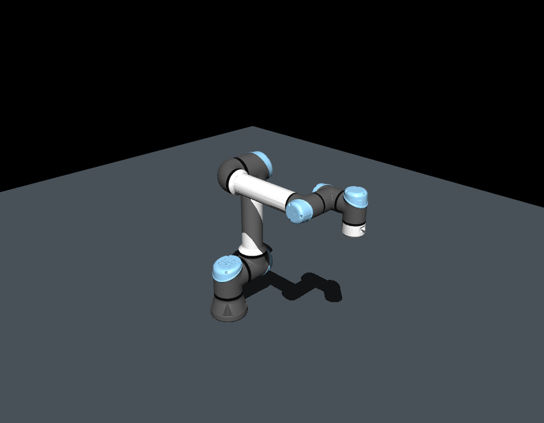

# mujoco-ros2-manipulation

MuJoCo, ROS 2 Humble, ros2_control 및 MoveIt 2를 연결하는 로봇팔 시뮬레이션
프로젝트입니다. 포트폴리오에서 모델 변환, 경로 계획과 실행, 상태 기반 완료
확인, 오류 분석 및 재현 가능한 검증을 보여주는 것을 목표로 합니다.

GitHub 저장소 이름은 `mujoco-ros2-manipulation`이며 공개 저장소로 업로드합니다.
원격 주소는 `https://github.com/WannaSleep3254/mujoco-ros2-manipulation.git`입니다.

## 지원 모델: FR5 · FR10 · UR5e

세 모델을 공통 실행기에서 선택할 수 있습니다. 2026-10-06에 실제 ROS 노드로
직접 궤적 명령, MoveIt 계획·실행, 상태·TF·시계, MuJoCo/RViz GUI 및 종료를
검증했습니다. 기존 FR5의 동작과 종료도 다시 통과했습니다.
UR5e는 2026-10-07에 원본 시각 모델을 적용한 뒤 같은 실행·종료 검증을
다시 통과했습니다.

| 모델 ID | 계획 그룹 | 궤적 제어기 | 계획 끝단 프레임 |
|---|---|---|---|
| `fr5` | `fairino5_v6_group` | `fairino5_controller` | `wrist3_link` |
| `fr10` | `fairino10_v6_group` | `fairino10_controller` | `wrist3_link` |
| `ur5e` | `ur5e_manipulator` | `ur5e_controller` | `tool0` |

### 모델별 문서와 스크린샷

[모델 자료 목록](docs/robots/README.md)에 실행·설정·좌표계·검증 기록과 이미지를
정리했습니다. 각 모델에는 초기 자세 렌더, 실제 MuJoCo GUI와 RViz 스크린샷,
촬영한 실행의 검증 JSON 및 이미지 해시가 있습니다.

| FR5 | FR10 | UR5e |
|---|---|---|
| [](docs/robots/fr5/README.md) | [](docs/robots/fr10/README.md) | [](docs/robots/ur5e/README.md) |
| [FR5 실행·설정·검증](docs/robots/fr5/README.md) | [FR10 실행·설정·검증](docs/robots/fr10/README.md) | [UR5e 실행·설정·검증](docs/robots/ur5e/README.md) |

미리보기는 모델마다 카메라를 맞춘 기준 렌더입니다. 실제 크기나 성능 비교를 위한
동일 조건 벤치마크는 아니며, GUI 사진과 생성 조건은 각 모델 페이지에 기록했습니다.
자료를 갱신하려면 [촬영·재생성 방법](docs/robots/capture.md)을 참고합니다.

### 모델 출처와 좌표계

FR5와 FR10은 [FAIRINO 공식 ROS 2 저장소](https://github.com/FAIR-INNOVATION/frcobot_ros2)의
URDF/STL 및 각 모델의 MoveIt 설정을 사용합니다. FR10의 링크 길이와 관성이
다르므로 위치 서보의 게인은 별도로 검증했습니다. URDF의 질량 합은 FR5 약
22.53 kg, FR10 약 39.73 kg입니다. 이는 모델의 값이며 실물 계측값이 아닙니다.
관절 토크 제한도 URDF에서 가져온 값으로 실물 모터 사양을 확인한 것은 아닙니다.
SRDF의 충돌 제외 쌍은 FR5 11개, FR10 14개로 모델별 설정을 유지합니다.

UR5e는 [공식 ROS 2 Description의 Humble 브랜치](https://github.com/UniversalRobots/Universal_Robots_ROS2_Description/tree/humble)를
고정한 커밋에서 가져옵니다. 공식 기구학·관성·관절 제한을 같은 URDF에서
MuJoCo와 ROS에 제공하고, 시뮬레이션용 `ur5e_moveit_config`를 추가했습니다.
계획 체인과 11개 충돌 제외 쌍은 [공식 MoveIt SRDF](https://github.com/UniversalRobots/Universal_Robots_ROS2_Driver/blob/humble/ur_moveit_config/srdf/ur_macro.srdf.xacro)를
기준으로 구성했습니다. 실제 UR 드라이버는 로딩하지 않습니다.

UR5e의 `wrist_3_link → flange → tool0` 고정 변환을 보존하고 `/tf_static`으로
발행합니다. 끝단 위치와 자세를 URDF의 독립적인 순기구학 계산과 MuJoCo에서
세 자세마다 비교해 일치를 확인했습니다. 공식 기본 기구학은 특정 실물 로봇의
보정값이 아닙니다. 그리퍼 TCP 오프셋도 아직 추가하지 않았습니다.
FR5/FR10의 계획 끝단은 기존 `wrist3_link`이며 별도의 `flange`/`tool0`/TCP를
새로 정의하지 않았습니다.

MuJoCo에서는 UR5e의 원본 DAE 시각 모델을 OBJ로 변환해 표시합니다.
DAE의 장면 변환·단위·표면 법선·재질별 색상을 보존하며, RViz는 원본 DAE를
사용합니다. 이전에는 단순화된 충돌 STL을 외형 표시에도 사용해 링크가 판처럼
보이고 관절 커버 색상이 사라졌습니다. 시각 모델 교체 후 원본과 각 링크의
배치를 세 자세에서 비교하고, 질량·관성·구동기·충돌 형상의 보존을 확인했습니다.
물리 충돌 형상은 세 모델 모두 STL의 convex hull 근사입니다.
UR5e의 예제 가속도 제한 1 rad/s²와 서보 게인은 실물 UR 제어기의 설정이 아닙니다.



다음 단계는 바닥·장애물을 MuJoCo와 MoveIt에 일치시킨 작업 장면, 그리퍼와
집기·이동·놓기 예제, 공통 작업 목표의 비교 표·영상입니다. 접촉 조립과
실제 로봇 연결은 후속 단계입니다.

## 모델별 설정과 공통 실행

| 설정 파일 | 내용 | 실행 상태 |
|---|---|---|
| `config/robots/fr5.yaml` | 제조사 모델·메시·SRDF 경로, 관절 순서, 초기 자세, 서보 게인, ROS 이름, 검증 목표 | `enabled: true`, 실행 검증 완료 |
| `config/robots/fr10.yaml` | FR10 모델·MoveIt 설정, 별도 게인과 검증 목표 | `enabled: true`, 실행 검증 완료 |
| `config/robots/ur5e.yaml` | 공식 Xacro, 관절 이름, `tool0` 체인, 제한·게인과 검증 목표 | `enabled: true`, 실행 검증 완료 |
| `config/controller_defaults.yaml` | 제어 주기, 위치 명령 인터페이스와 공통 궤적 허용 오차 | 모델의 관절·제어기 이름과 합쳐 YAML 생성 |

현재 PC에서는 다음 명령으로 모델을 선택해 MuJoCo와 RViz를 실행합니다.
기본 대화형 실행은 도메인 89를 공유하므로 기존 시뮬레이션을 종료한 뒤
한 모델씩 실행합니다.

```bash
cd ~/projects/isaac_sim_setup
.venv/bin/python prepare_robot.py --list
bash run_sim.sh robot:=fr5
bash run_sim.sh robot:=fr10
bash run_sim.sh robot:=ur5e
```

다른 PC에서는 아래 설치 구성에 따라 ROS 패키지와 로컬 런타임을 준비해야 합니다.
`prepare_robot.py`는 모델을 `models/<모델명>/`에 생성하고, 제어기 설정은
`runtime/generated/<모델명>/controllers.yaml`에 생성합니다. MoveIt의 컨트롤러
연결 설정도 같은 프로필에서 생성하므로 관절 목록과 제어기 이름을 중복 작성하지
않습니다. URDF에 `world` 고정 관절이 있으면 별도 TF 발행기를 만들지 않습니다.

모델별 ROS 패키지를 빌드하고 세 모델을 생성하려면 `bash build_robot_packages.sh`를
실행합니다. 이미 빌드된 모델 하나만 다시 생성할 때는 다음을 사용합니다.

```bash
.venv/bin/python prepare_robot.py --robot fr10
.venv/bin/python prepare_robot.py --robot ur5e
```

UR5e의 DAE 변환에는 `pycollada==0.9.3`이 필요하며 `requirements.txt`에
포함되어 있습니다. 변환된 OBJ는 `runtime/generated/ur5e/visual_meshes/`에
생성합니다. 실행 중인 시뮬레이션에는 재생성 결과가 자동 적용되지 않으므로
기존 실행을 Ctrl+C로 종료한 뒤 `bash run_sim.sh robot:=ur5e`로 다시 실행합니다.

프로필의 `home_rad`, `servo.kp`, `servo.kv`와 검증 목표 배열은 `joints`의
순서와 길이에 맞춰 작성합니다. 변환기는 관절 이름으로 MuJoCo의 초기 자세와
구동기를 연결합니다. 프로필을 수정한 뒤에는 모델을 다시 생성해야 하며,
실행기와 검증기는 프로필 해시가 다른 오래된 생성 모델을 사용하지 않습니다.

검증은 ROS 환경을 로드한 뒤 시스템 Python으로 실행합니다.

```bash
source ./manipulation_env.sh
python3 verify_robot.py --robot fr10 --domain 90
python3 verify_robot.py --robot fr10 --domain 90 --gui
python3 verify_robot.py --robot fr10 --domain 90 --gui --stop-mode window
python3 verify_robot.py --robot ur5e --domain 91
python3 verify_robot.py --robot ur5e --domain 91 --gui
python3 verify_robot.py --robot ur5e --domain 91 --gui --stop-mode window
python3 verify_robot.py --robot fr5 --domain 92
.venv/bin/python -m unittest discover -s tests -v
```

공통 검증기는 선택한 모델의 관절 상태, 제어기 활성화, 직접 궤적 실행,
MoveIt 계획·실행, 예상 TF, 시뮬레이션 시계와 정상 종료를 확인합니다.
구조·변환 검사 11개에는 다른 제어기 이름과 관절 수, 관절 순서 변경 시 MuJoCo
매핑, 잘못된 배열, 미준비 모델과 오래된 생성 모델의 실행 차단, 세 모델의 끝단
순기구학 일치를 포함합니다. UR5e 시각 모델의 단위·배치·색상·법선 및
물리 모델 보존도 검사합니다. 변환 검사는 제조사 소스·생성 모델이 필요하며
자료가 없으면 해당 검사를 건너뜁니다.

| 모델 | 검증한 궤적 종료 후 최대 관절 오차 | headless / GUI 궤적 실행 | Ctrl+C / 창 닫기 종료 |
|---|---|---|---|
| FR5 | 약 0.0036 rad | 통과 | 통과 |
| FR10 | 약 0.0014 rad | 통과 | 통과 |
| UR5e | 약 0.0041 rad | 통과 | 통과 |

이는 서로 다른 예제 목표와 게인에서 얻은 결과로 모델 간 성능 순위가 아닙니다.
모든 종료 모드에서 launch 코드 0, 잔류 프로세스 없음과 정상 종료를 확인했습니다.
창 닫기는 Trigger 서비스로 GUI와 같은 종료 경로를 실행한 검사입니다.
결과는 [FR5](docs/fr5_shutdown_validation.json), [FR10](docs/fr10_validation.json),
[UR5e](docs/ur5e_validation.json)에 기록했습니다. 상세 로그는 로컬
`runtime/validation/<모델명>_<headless|gui|gui_window>.log`에 저장합니다.

기존 `prepare_fr5.py`, `run_fr5.sh`, `fr5.launch.py`, `fr5_env.sh`,
`verify_fr5.py`, `build_fr5_runtime.sh`는 호환 진입점으로 유지했습니다.
공통 환경의 도메인은 `MANIPULATION_ROS_DOMAIN_ID`로 지정할 수 있고,
`fr5_env.sh`에서는 기존 `FR5_ROS_DOMAIN_ID`도 지원합니다.

## FAIRINO FR5 시뮬레이션 실행

FR5 V6의 제조사 URDF/STL을 MuJoCo 모델로 변환하고, ROS 2 Humble의
`mujoco_ros2_control`과 MoveIt 2를 연결했습니다. 실행 구조는 다음과 같습니다.

```text
MoveIt 2 / ROS 2 궤적 명령
  → fairino5_controller (JointTrajectoryController)
  → mujoco_ros2_control
  → MuJoCo FR5 6축 위치 서보
  → /joint_states, /tf, /clock
```

데스크톱 터미널에서 아래 명령을 실행하면 **MuJoCo와 RViz 창이 함께 열립니다.**
자동 검증 중 열었던 창은 검증 후 종료했습니다.

```bash
cd ~/projects/isaac_sim_setup
bash run_fr5.sh
```

RViz의 MotionPlanning에서 Planning Group을 `fairino5_v6_group`으로 선택합니다.
시작 상태를 현재 상태로 두고, 목표 상태의 끝단 마커를 조금 움직인 뒤
`Plan`으로 궤적을 확인하고 `Execute`로 MuJoCo에서 실행할 수 있습니다.
관절 이름은 `j1`부터 `j6`까지이며 각도 단위는 rad입니다.

CLI로도 움직임을 확인할 수 있습니다. 다른 터미널에서 다음 명령을 실행하면
기본 자세를 기준으로 첫 관절을 0.2 rad까지 3초에 걸쳐 이동합니다.

```bash
cd ~/projects/isaac_sim_setup
source ./fr5_env.sh
ros2 action send_goal /fairino5_controller/follow_joint_trajectory \
  control_msgs/action/FollowJointTrajectory \
  '{trajectory: {joint_names: [j1, j2, j3, j4, j5, j6],
    points: [{positions: [0.2, -1.2, 1.2, -1.5, -1.5, 0.0],
      velocities: [0.0, 0.0, 0.0, 0.0, 0.0, 0.0],
      time_from_start: {sec: 3}}]}}'
```

이 명령은 MoveIt의 충돌 경로 계획을 거치지 않는 제어기 직접 검증입니다.
FR5에서는 기존 1관절 데모의 `/mujoco/target_position`을 사용하지 않습니다.

```bash
ros2 control list_controllers
ros2 topic echo /joint_states sensor_msgs/msg/JointState --once
ros2 topic echo /clock rosgraph_msgs/msg/Clock --once
```

관련 터미널에서는 `source ./fr5_env.sh`를 적용합니다. FR5는 ROS 도메인 **89**,
기존 1관절 데모는 **87**을 사용합니다. 자동 검증은 기본 도메인 **90**이며,
이번 모델 확장 검증은 FR10 **90**, UR5e **91**, FR5 **92**에서 수행했습니다.
`fr5_env.sh`는 공통 `manipulation_env.sh`를 통해 기존 `dev_ws`, `ws_moveit`
등의 환경 대신 `/opt/ros/humble`과 이 프로젝트의 패키지를 로드합니다.
셸 초기 설정 파일은 수정하지 않았습니다.

GUI 없이 실행하거나 RViz를 제외하려면 다음과 같이 실행합니다.

```bash
bash run_fr5.sh gui:=false rviz:=false
bash run_fr5.sh moveit:=false rviz:=false
```

### FR5 검증 결과와 현재 제약

2026-10-06에 실제 ROS 노드를 별도 프로세스로 실행하여 확인했습니다.
FR10·UR5e 연동 후에도 아래 세 실행 모드를 다시 검증했습니다.

- MuJoCo FR5 모델 로딩, 6개 관절 상태, 두 제어기 활성화: 통과.
- FollowJointTrajectory 명령에 따른 실제 MuJoCo 관절 동작: 통과.
- MoveIt OMPL 경로 계획과 실행: headless / GUI 모두 통과, 각각 49개 궤적점.
- 검증한 궤적 종료 후 최대 관절 추종 오차: 약 0.0036 rad, 약 0.21도.
- 시뮬레이션 시계의 단조 증가와 6개 이동 링크 TF: 통과.
- GTX 1050 Ti에서 MuJoCo `ros2_control_node`와 RViz 그래픽 프로세스 확인.
- RViz OpenGL 4.6, MotionPlanning 패널 연결 확인.
- 종료 수정 후 headless의 Ctrl+C, GUI의 Ctrl+C, MuJoCo 창 닫기 경로를
  모두 통과했습니다. 세 실행 모두 launch 종료 코드 0, 자식 프로세스 정상
  종료, 잔류 프로세스 없음으로 확인했습니다. 각 재실행의 동작 검증도 통과했습니다.

자동 검증은 궤적을 실행한 뒤 모든 검증 프로세스를 종료합니다.

```bash
source ./fr5_env.sh
python3 verify_fr5.py
python3 verify_fr5.py --gui
python3 verify_fr5.py --gui --stop-mode window
```

결과와 로그는 `runtime/validation`의 `fr5_headless`, `fr5_gui`,
`fr5_gui_window` 이름으로 저장합니다. JSON의 `motion_checks_passed`는 동작 검사,
`shutdown_clean`은 종료 검사입니다. 세 실행 모두 `shutdown_clean: true`,
`launch_return_code: 0`, `process_group_gone: true`를 확인했습니다.
종료 검사에서 오류가 나면 동작 검사 통과 결과를 보존하고 종료 코드 1을 반환합니다.
Git에 포함하는 검증 요약은 [docs/fr5_shutdown_validation.json](docs/fr5_shutdown_validation.json)에
기록했습니다. 원본 로그는 로컬 `runtime/validation`에 보관합니다.

### 이상 종료 원인과 해결

기존 `exit code -11`은 SIGSEGV로, 종료 중 잘못된 메모리 접근을 뜻합니다.
궤적 동작 실패와는 별도로 발생했습니다. 현재 PC의 로그, 스택 및 소스와
수정 전후 실행을 비교해 다음과 같이 처리했습니다.

| 구분 | 원인 및 근거 | 적용한 해결 |
|---|---|---|
| MuJoCo GUI | OpenGL/GLFW 자원을 만든 렌더링 스레드가 끝난 뒤, 다른 스레드에서 UI 자원을 해제했습니다. `libGLdispatch`에서 충돌했고 소스의 해제 순서를 확인했습니다. | `RenderLoop` 종료 직후 같은 렌더링 스레드에서 `platform_ui.reset()`으로 자원을 해제하도록 `mujoco_ros2_control` 0.1.2를 수정했습니다. |
| MoveIt / RViz | `rclcpp::CallbackGroup` 및 궤적 실행 관리자의 종료 스택에서 충돌했습니다. MoveIt 플러그인의 코드가 남은 ROS 객체보다 먼저 해제되는 수명 문제로 판단했습니다. 플러그인 해제를 지연한 비교 실행에서 충돌이 사라졌습니다. | `libmoveit_*` 플러그인에 `RTLD_NODELETE`를 적용해 코드가 프로세스 종료까지 유지되게 했습니다. 공통 launch의 `move_group`과 RViz에만 적용하는 임시 우회 처리이며, 정확히 어느 플러그인에서 시작되는지는 특정하지 못했습니다. |
| 실행 전체의 정리 | 주 창이나 핵심 노드 하나가 종료돼도 다른 시뮬레이션 프로세스가 계속 남을 수 있었습니다. | 핵심 노드의 종료를 launch가 감지해 나머지도 종료하도록 했습니다. 검증기는 launch 부모에 SIGINT를 한 번 보내 중복 종료 신호를 피합니다. |

MuJoCo 창 닫기 검증은 아래 서비스로 `exitrequest`를 설정하여 창 닫기 버튼과
같은 `RenderLoop` 종료 경로를 실행했습니다. 실제 마우스 클릭으로 검증한 것은
아닙니다. RViz 종료도 전체 launch 정리에 연결되어 있지만 RViz 닫기 버튼의
동작은 별도 검증하지 않았습니다.

```bash
source ./fr5_env.sh
ros2 service call /mujoco_ros2_control_node/close_window std_srvs/srv/Trigger '{}'
```

수정은 프로젝트의 로컬 빌드와 실행 설정에만 적용했습니다. `/opt/ros`와
NVIDIA 드라이버는 변경하지 않았습니다. RViz 종료 시 `context is invalid`
진단 메시지는 남을 수 있으나, 최종 검증에서는 프로세스가 코드 0으로 종료했고
SIGSEGV는 재현되지 않았습니다. 이 결과는 아래에 기록한 현재 버전 조합에 대한
검증이며 모든 ROS/MoveIt 버전의 문제가 해결됐다는 의미는 아닙니다.

위치 서보에도 중력, 관성 및 토크 제한이 적용되므로 목표 각도로 즉시
고정되지 않습니다. 게인, 관절 감쇠 및 armature는 데모 설정이며 실제
FR5의 식별된 모터 모델은 아닙니다. 충돌 형상은 제조사 STL의 convex hull
근사입니다. 그리퍼, 조립 부품, 외부 장애물 및 실제 로봇 연결은 포함하지
않았습니다. MuJoCo의 바닥은 아직 MoveIt 계획 장면에 등록하지 않았습니다.

### 공통 파일과 설치 구성

| 파일 | 역할 |
|---|---|
| `robot_config.py` / `config/robots/*.yaml` | 모델 설정 로딩·검사와 제어기 설정 생성 |
| `run_sim.sh` / `manipulation_env.sh` | 모델 선택 실행 및 공통 ROS 환경 설정 |
| `manipulation.launch.py` | MuJoCo, ros2_control, MoveIt, RViz 공통 실행 |
| `models/fr5/fr5.xml` | 6축 MuJoCo 모델과 위치 서보 |
| `models/fr5/fr5.ros2_control.urdf` | ROS 로봇 모델과 MuJoCo 하드웨어 인터페이스 |
| `config/controller_defaults.yaml` | 모델들에 공통인 관절 궤적 제어 설정 |
| `prepare_robot.py` / `models/fr5/source.json` | 공통 변환 코드, 출처 및 모델 설정 기록 |
| `collada_visuals.py` | UR 원본 DAE 시각 모델을 재질별 OBJ로 변환 |
| `verify_robot.py` | 모델별 ROS 궤적 명령과 MoveIt 계획·실행 검증 |
| `capture_robot_images.py` / `docs/robots` | 모델별 기준 렌더·실제 GUI 촬영과 문서·이미지·검증 자료 |
| `tests/test_robot_profiles.py` | 설정 선택, 재생성 요구와 관절 매핑 회귀 검사 |
| `tests/test_collada_visuals.py` | DAE 장면·색상·법선, 로봇 자세별 메시 배치와 물리 모델 보존 검사 |
| `build_robot_packages.sh` | 고정한 제조사 소스 확인·다운로드, 모델별 ROS 패키지 빌드 및 모델 생성 |
| `packages/ur5e_moveit_config` | UR5e 공식 Xacro 연결, `tool0` 계획 체인, KDL 및 RViz 설정 |
| `build_runtime.sh` | 공통 로컬 종료 수정 재빌드 |
| `native/moveit_plugin_lifetime.c` | MoveIt 플러그인 수명 우회 처리 |
| `patches/mujoco_ros2_control-0.1.2-shutdown.patch` | MuJoCo UI 종료 순서 수정, 창 닫기 서비스 및 로컬 빌드 설정 |
| `requirements.txt` | Python 데모, 모델 변환과 YAML 로딩 의존성 |

원본은 [FAIR-INNOVATION/frcobot_ros2](https://github.com/FAIR-INNOVATION/frcobot_ros2)의
커밋 `fcf0c7f0d60d949d8a9a4238f929a44d07f60379`입니다.
원본 저장소는 `external/frcobot_ros2`에 두었으며 원본 파일을 수정하지 않았습니다.
제조사 패키지 중 `fairino_description`, `fairino5_v6_moveit2_config`,
`fairino10_v6_moveit2_config`를 빌드했습니다. UR 모델 소스는
`Universal_Robots_ROS2_Description`의 커밋
`65fa221f6d9e1904b30b6a05ae39cb24a0c40fac`이며 `ur_description` 2.14.0과
이 프로젝트의 `ur5e_moveit_config`를 빌드했습니다. UR Description은
BSD-3-Clause이며 따로 다운로드합니다. 시뮬레이션용 MoveIt 설정의 출처와
라이선스는 패키지의 `NOTICE`와 `LICENSE`에 기록했습니다.
종료 수정 후 `mujoco_ros2_control`도 `ros_ws/install`에 로컬 빌드했습니다.
실제 로봇 드라이버는 실행하지 않았습니다.

관리자 암호가 필요해 시스템 apt 설치는 수행되지 않았습니다. 공식 apt의
`mujoco_ros2_control` 0.1.2를 포함한 런타임 deb 5개와 빌드 의존성
`libglfw3-dev`, `ros-humble-ros2-control-cmake`를 `runtime/root`에 추출했습니다.
MuJoCo 연동 소스는 [ros-controls/mujoco_ros2_control](https://github.com/ros-controls/mujoco_ros2_control)의
태그 `0.1.2`, 커밋 `178b1c39e5010185116bc89b4e94cbb25b825f61`에 패치를 적용했습니다.
이 패치의 상류 소스 라이선스는 [Apache-2.0](patches/Apache-2.0.txt)입니다.
시스템 MoveIt 2 버전은 2.5.10입니다.
**이 ROS 런타임의 물리 엔진은 MuJoCo 3.12.0**이며,
기존 `.venv`의 Python MuJoCo 3.14.0과 별개입니다.
위 연동 방식은 [ros2_control 공식 문서](https://control.ros.org/humble/doc/mujoco_ros2_control/doc/index.html)를
기준으로 구성했습니다.

세 모델의 ROS 패키지와 생성 모델을 재빌드하려면:

```bash
cd ~/projects/isaac_sim_setup
bash build_robot_packages.sh
bash build_runtime.sh
```

`build_runtime.sh`는 캐시한 deb와 소스를 사용해 재빌드하며, 소스가 없으면
위 태그를 복제합니다. 버전이 다르거나 패치를 적용할 수 없으면 기존 소스를
덮어쓰지 않고 중단합니다.

### Git에 포함하는 파일과 다른 PC에서의 준비

소스, 제어 설정, 검증 스크립트와 종료 수정 패치를 Git에 포함합니다.
`.venv`, `external`, `runtime`, `ros_ws`와 생성된 모델 XML/URDF는 제외합니다.
따라서 제조사 STL, 다운로드한 deb, 빌드 결과와 로컬 실행 로그는 저장소에
포함되지 않습니다. `prepare_robot.py --robot <모델명>`이 선택한 모델을 해당 PC의
경로에 맞게 생성합니다. YAML 로딩은 ROS 환경의 PyYAML 5.4.1에서 검증했습니다.

다른 PC에서는 Ubuntu 22.04 / ROS 2 Humble, MoveIt 2, ros2_control,
ros2_controllers, Cyclone DDS, Xacro, colcon 및 C++ 빌드 도구가 먼저 필요합니다.
현재 설치된 시스템 ROS 패키지는 Git에 포함되지 않습니다. 다음 명령은 해당
기본 환경과 `python3-venv`, `python3-pip`가 준비되어 있다는 전제입니다.

```bash
python3 -m venv --system-site-packages .venv
.venv/bin/python -m pip install -r requirements.txt
mkdir -p external runtime/debs
cd runtime/debs
apt download libglfw3 libglfw3-dev \
  ros-humble-mujoco-vendor=0.1.1-1jammy.20260907.141308 \
  ros-humble-mujoco-ros2-control=0.1.2-1jammy.20260908.125234 \
  ros-humble-mujoco-ros2-control-msgs=0.1.2-1jammy.20260907.213024 \
  ros-humble-mujoco-ros2-control-plugins=0.1.2-1jammy.20260907.225305 \
  ros-humble-ros2-control-cmake=0.2.1-1jammy.20260304.202614
cd ../..
bash build_runtime.sh
bash build_robot_packages.sh
```

`build_robot_packages.sh`는 소스가 없으면 고정한 커밋만 내려받고 해당 모델
패키지만 빌드합니다. 기존 소스의 커밋이 다르면 덮어쓰지 않고 중단합니다.
고정한 deb 버전을 apt에서 구할 수 없다면 다른 버전 조합은 다시 검증해야 합니다.

## 기존 1관절 데모

Environment: Ubuntu 22.04, Python 3.10, ROS 2 Humble.
MuJoCo 3.14.0 and NumPy 1.26.4 are installed in `.venv`, which inherits
system packages so that the existing ROS 2 Python bindings remain accessible.
System Python packages were not modified.

## Repeat the integration test

```bash
cd ~/projects/isaac_sim_setup
source ./ros2_env.sh
.venv/bin/python verify_mujoco_ros2.py
```

The test runs the actual `mujoco_ros2_bridge.py` and a ROS command client in
separate processes. A Float64 target is published on `/mujoco/target_position`;
the simulator publishes JointState on `/joint_states` and Clock on `/clock`.
Both +0.5 and -0.3 rad commands must converge within 0.01 rad for ten
consecutive messages. Domain 87 isolates the test from default-domain robots.
The model rotates about a vertical axis and does not test gravity compensation.

## Open a model in the GUI

The validation model is also available as `models/single_joint.xml`. It is a
single rotating link, not a complete robot arm. Open it from a desktop terminal:

```bash
cd ~/projects/isaac_sim_setup
.venv/bin/python -m mujoco.viewer --mjcf=models/single_joint.xml
```

Alternatively, drag the XML file into an already-open MuJoCo viewer. Change the
`joint1_servo` control slider to set the target joint angle in radians. This
standalone viewer does not connect to ROS 2; use the integration test above to
check ROS command / state communication.

## ROS 2로 GUI 모델 제어하기

연동 구조는 `ROS 2 목표 각도 → Python 브리지 → MuJoCo 위치 서보`이며,
현재 1관절 모델용 직접 연동입니다. ros2_control 또는 MoveIt 2 플러그인이
아니며, 추가 패키지 설치나 colcon 빌드 없이 실행할 수 있습니다.

터미널 1에서 GUI와 ROS 브리지를 함께 실행합니다. 기존 standalone 뷰어를
닫으면 창을 구분하기 쉽습니다.

```bash
cd ~/projects/isaac_sim_setup
source ./ros2_env.sh
.venv/bin/python mujoco_ros2_bridge.py
```

터미널 2에서도 동일한 환경을 적용한 뒤 목표 각도를 보냅니다.

```bash
cd ~/projects/isaac_sim_setup
source ./ros2_env.sh
ros2 topic pub --once /mujoco/target_position std_msgs/msg/Float64 '{data: 0.8}'
```

`0.8`은 약 45.8도입니다. 반대 방향으로 움직이려면:

```bash
ros2 topic pub --once /mujoco/target_position std_msgs/msg/Float64 '{data: -0.5}'
```

관절의 실제 상태와 시뮬레이션 시간은 다음으로 확인합니다.

```bash
ros2 topic echo /joint_states sensor_msgs/msg/JointState --once
ros2 topic echo /clock rosgraph_msgs/msg/Clock --once
```

| 토픽 | 메시지 | 역할 |
|---|---|---|
| `/mujoco/target_position` | `std_msgs/msg/Float64` | 목표 각도 입력, rad |
| `/joint_states` | `sensor_msgs/msg/JointState` | 각도, 각속도, 적용 구동 토크 |
| `/clock` | `rosgraph_msgs/msg/Clock` | MuJoCo 시뮬레이션 시간 |

기본 물리 계산 간격은 0.002초, 상태·시간 발행은 50Hz, GUI 동기화는
최대 약 60Hz입니다. 상태 타임스탬프는 MuJoCo 시간으로 채웁니다.
다른 소비 노드에서 이 시간을 사용하려면 `use_sim_time:=true`를 설정합니다.
이 옵션은 하드웨어 선택이나 ROS 도메인을 변경하지 않습니다.

`ros2_env.sh`는 도메인 87과 localhost 통신을 설정하므로 관련 터미널마다
source해야 합니다. GUI 모드에서도 ROS 명령이 제어 입력을 결정하므로
Control 슬라이더 조작은 다음 물리 스텝에서 덮어씁니다.
창을 닫거나 터미널 1에서 Ctrl+C를 누르면 종료합니다.

### rqt에서 모니터링하기

새 터미널에서 프로젝트로 이동하고 `source ./ros2_env.sh`를 적용한 뒤
`rqt`를 실행합니다. Topic Monitor에서 `/joint_states`와 `/clock`을 선택하고,
Message Publisher에서 `/mujoco/target_position`의 `data` 값을 입력하면 됩니다.
퍼블리셔의 체크박스를 켜면 입력한 각도를 지정 주기로 전송합니다.

`/clock`은 rqt의 reliable 구독 요청과 기본 best-effort 시간 구독 모두를
지원하도록 reliable QoS로 발행합니다. 이전 브리지에서 RELIABILITY 불일치
경고가 발생했다면 브리지를 Ctrl+C로 종료하고 다시 실행해야 수정이 적용됩니다.
`lo is not multicast-capable: disabling multicast` 메시지는 localhost 통신
설정에서 나타날 수 있으며, 명령·상태 수신이 된다면 통신 실패를 뜻하지 않습니다.

화면 없이 실행하려면 `.venv/bin/python mujoco_ros2_bridge.py --headless`를
사용합니다. GUI를 포함한 자동 검증은 데스크톱 세션에서
`.venv/bin/python verify_mujoco_ros2.py --gui`로 실행할 수 있습니다.
검증은 잠시 창을 열고 두 목표 각도를 전송한 뒤 종료합니다.

## Verified results

- MuJoCo import and model compilation: passed.
- 10,000 physics steps (20 simulated seconds): passed, about 0.017 seconds
  on this very small model; this is not a robot-arm performance benchmark.
- Cross-process ROS 2 command / state communication in both headless and GUI
  bridge modes: passed.
- +0.5 rad target: approximately +0.4976 rad at verification.
- -0.3 rad target: approximately -0.2977 rad at verification.
- GUI bridge tracking: approximately +0.4977 rad and -0.2980 rad for the same
  targets, within 0.01 rad for ten consecutive messages.
- Simulation clock in both modes: passed; monotonically increasing timestamps.

The user's subsequent rqt screenshot confirms 50 Hz joint states and an actual
position of approximately 0.8 rad for a 0.8 rad command. It also exposed a clock
QoS mismatch with reliable subscribers, addressed by reliable clock publishing.
The clock compatibility regression test passed in domain 88: both best-effort
and reliable subscribers received 73 increasing clock messages. Joint target
tracking also passed. Domain 88 kept this test separate from the running demo.
- EGL offscreen rendering: passed, RGB frame shape (120, 160, 3).

The user-provided desktop screenshots on 2026-10-02 confirm that the GUI viewer
opens, loads `single_joint_validation`, and shows both target and actual angles
as 0.59 rad. Desktop OpenGL uses the GTX 1050 Ti, and `.venv/bin/python` appears
as a graphics process in nvidia-smi. The earlier driver / display failures in the
agent environment do not describe the user's current desktop session.
Successful EGL rendering alone does not establish which GPU backend it uses.
The FR5 multi-joint / ros2_control / MoveIt results are documented above.
Physical hardware has not been tested.

## Installation method

The host lacks ensurepip/python3-venv support. The environment was created with
`python3 -m venv --without-pip --system-site-packages .venv`, then dependencies
were installed using the system pip with `--target .venv/lib/python3.10/site-packages`.
Use `.venv/bin/python` to run MuJoCo; do not use the system pip without a target
to update this environment.
