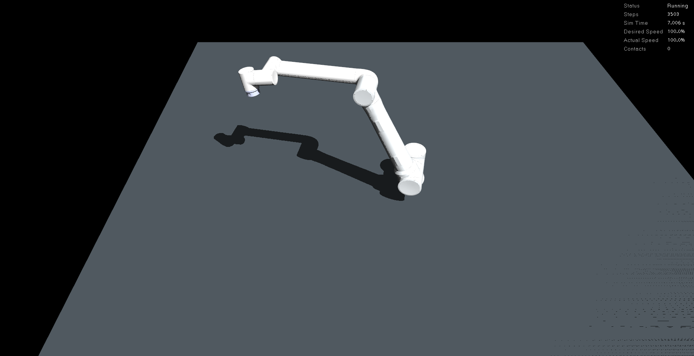
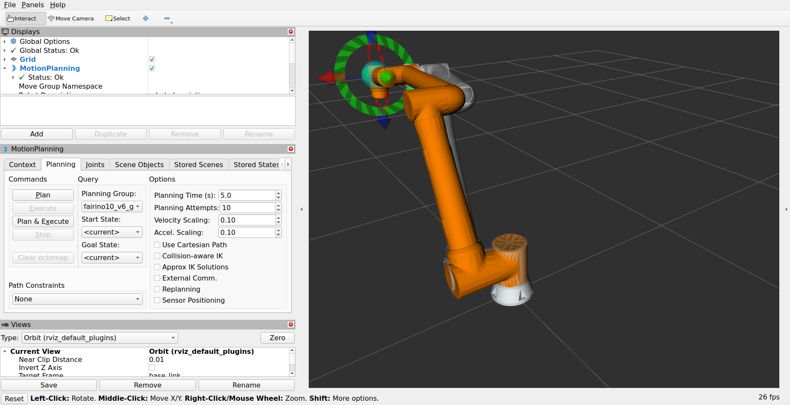

# FAIRINO FR10 V6

[모델 자료 목록](../README.md) · [프로젝트 README](../../../README.md)

FR5와 같은 관절 이름과 실행 구조를 사용하되, FR10 V6의 링크·관성·충돌 설정을 별도로 불러옵니다. 질량과 링크 길이가 달라 서보 게인을 모델별로 설정했습니다.


`home_rad`의 초기 자세를 MuJoCo Python 3.14.0으로 렌더한 이미지입니다.
물리 정착 전의 기구학적 기준 자세이며, 카메라는 로봇 형상에 맞춰 자동 배치합니다.
[촬영 조건과 관절값](reference_image.json)을 함께 보관합니다.

## 모델 구성

| 항목 | 설정 |
|---|---|
| 모델 선택 ID | `fr10` |
| 프로필 | [config/robots/fr10.yaml](../../../config/robots/fr10.yaml) |
| MoveIt 패키지 | `fairino10_v6_moveit2_config` |
| 계획 그룹 | `fairino10_v6_group` |
| 궤적 제어기 | `fairino10_controller` |
| 계획 끝단 | `wrist3_link` |
| 기본 프레임 | `base_link` |
| 제조사 URDF 질량 합 | 39.72775 kg |
| SRDF 충돌 제외 쌍 | 14개 |
| 시각 모델 | 제조사 STL |
| 물리 충돌 모델 | 제조사 STL의 MuJoCo convex hull 근사 |

계획 체인의 마지막 링크는 `wrist3_link`입니다. FR5와 마찬가지로 별도 `flange`, `tool0` 또는 그리퍼 TCP를 추가하지 않았습니다. FR5의 링크 길이·질량·게인을 FR10에 그대로 적용하지 않습니다.

질량·관절 제한은 URDF의 모델 값입니다. 실물 계측 또는 모터 식별 결과가 아니며,
서보 게인은 시뮬레이션 예제 설정입니다. 아래 속도 값은 URDF 제한으로, MuJoCo에
자동적인 관절 속도 제한을 추가하는 값은 아닙니다.

| 관절 순서 | 초기 각도 (rad) | Kp | Kv | URDF effort (Nm) | URDF velocity (rad/s) |
|---|---:|---:|---:|---:|---:|
| `j1` | 0 | 4000 | 140 | 150 | 3.1500 |
| `j2` | -1.2 | 14000 | 320 | 150 | 3.1500 |
| `j3` | 1.2 | 10000 | 250 | 150 | 3.1500 |
| `j4` | -1.5 | 1600 | 40 | 28 | 3.2000 |
| `j5` | -1.5 | 1000 | 25 | 28 | 3.2000 |
| `j6` | 0 | 700 | 18 | 28 | 3.2000 |

물리 계산 간격은 0.002초, ros2_control 갱신은 100 Hz, 관절 상태 발행 설정은
50 Hz입니다. 위치 명령을 서보 토크로 변환하므로 중력·관성·토크 포화의 영향을 받습니다.

## 실행과 모델 변경

설치와 최초 빌드는 [공통 설치 안내](../../setup.md)를
따릅니다. 아래 명령은 저장소 루트에서 실행합니다.

```bash
bash run_sim.sh robot:=fr10
```

MuJoCo와 RViz가 함께 열립니다. RViz MotionPlanning의 Planning Group 값을
`fairino10_v6_group`으로 선택하고, 현재 상태에서 목표 마커를 이동한 뒤
`Plan`으로 경로를 확인하고 `Execute`로 실행합니다. 관절 각도 단위는 rad입니다.

GUI 없이 실행하거나 MuJoCo만 실행하려면:

```bash
bash run_sim.sh robot:=fr10 gui:=false rviz:=false
bash run_sim.sh robot:=fr10 moveit:=false rviz:=false
```

프로필의 초기 자세·게인·검증 목표를 수정한 뒤에는 모델을 재생성하고 재실행합니다.
초기 자세와 게인 배열은 위 관절 순서를 따릅니다.

```bash
.venv/bin/python prepare_robot.py --robot fr10
bash run_sim.sh robot:=fr10
```

모델 재생성 결과는 실행 중인 창에 자동 반영되지 않습니다. 다른 모델로 바꾸려면
현재 launch를 Ctrl+C로 종료하고 원하는 `robot:=` 값으로 다시 실행합니다.
공통 실행 도메인은 89입니다. `use_sim_time`은 시간 기준이며 모델 선택 옵션은 아닙니다.

## 실제 GUI 스크린샷

2026-10-07에 별도 ROS 도메인 90에서 직접 궤적 명령과 MoveIt ROS API
계획·실행을 완료한 뒤 촬영했습니다. 이미지 픽셀을 보정하거나 합성하지 않았으며,
촬영용 launch의 창만 크기·카메라를 조정했습니다.

### MuJoCo



위 화면은 ROS 런타임의 MuJoCo 3.12.0 GUI입니다. 초기 자세 렌더와는 실행 시점과
카메라가 다릅니다. 실행 후 자세와 상태 패널을 함께 확인할 수 있습니다.

### RViz / MoveIt 2



주황색 로봇은 RViz의 계획 요청 표시이고 반투명 모델은 Planning Scene의 현재 상태입니다.
검증기는 ROS API로 궤적을 생성·실행합니다. 실제 관절 상태와 실행 결과는
[촬영 실행의 검증 기록](gui_capture_validation.json)에 보관했습니다.

## 검증 결과

기존 [전체 검증 요약](../../fr10_validation.json)은 실행 모드별 검사와 종료 검사를 기록합니다.
아래 날짜는 해당 기록의 한국 시간이며, 이번 스크린샷 촬영 실행의 날짜는 별도 JSON에 있습니다.

| 실행 모드 | 기존 검증 시각 (KST) | 궤적·MoveIt·TF·시계 | 최대 관절 오차 (rad) | 종료 |
|---|---|---|---:|---|
| headless · SIGINT | 2026-10-06 17:42 | 통과 | 0.001441 | `0` · 잔류 없음 |
| GUI · SIGINT | 2026-10-06 17:42 | 통과 | 0.001441 | `0` · 잔류 없음 |
| GUI · 창 닫기 경로 | 2026-10-06 17:42 | 통과 | 0.001441 | `0` · 잔류 없음 |

궤적 Action의 성공 결과를 받은 뒤, 관절 오차가 0.01 rad 이내인 상태 메시지를
10개 연속 수신해 완료를 확인합니다. 창 닫기 검증은 Trigger 서비스로 GUI와 같은
종료 경로를 실행한 검사입니다. 실제 마우스 클릭 검증으로 기록하지 않습니다.

다시 검증하려면 ROS 환경을 적용하고 시스템 Python을 사용합니다.

```bash
source ./manipulation_env.sh
python3 verify_robot.py --robot fr10 --domain 90
python3 verify_robot.py --robot fr10 --domain 90 --gui
python3 verify_robot.py --robot fr10 --domain 90 --gui --stop-mode window
```

이 오차는 예제 목표와 게인에서 얻은 결과입니다. 다른 모델과 성능 순위를 비교하는
벤치마크 결과가 아닙니다. 그리퍼·TCP 도구·조립 부품·외부 장애물 장면과 실물 로봇
연결은 아직 구현하지 않았고, MuJoCo 바닥은 MoveIt 계획 장면에 등록하지 않았습니다.

## 출처와 자료

- [제조사 소스](https://github.com/FAIR-INNOVATION/frcobot_ros2/tree/fcf0c7f0d60d949d8a9a4238f929a44d07f60379) — 고정 커밋 `fcf0c7f0d60d949d8a9a4238f929a44d07f60379`.
- [모델 생성·출처 기록](../../../models/fr10/source.json).
- [프로필](../../../config/robots/fr10.yaml) 및 [공통 제어 설정](../../../config/controller_defaults.yaml).
- [공통 검증 안내](../../verification.md)와 [종료 오류 분석](../../troubleshooting.md).
- [전체 검증 요약](../../fr10_validation.json)과 [이번 GUI 촬영 검증](gui_capture_validation.json).
- [이미지 목록·해시·촬영 정보](assets.json) 및 [자료 재생성 방법](../capture.md).
